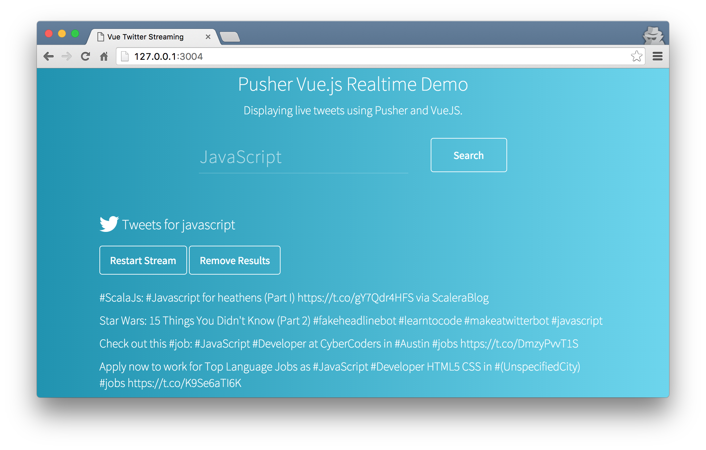

# Pusher and VueJS Realtime Twitter Search

A client of the [Pusher Datasource API](https://github.com/pusher-community/pusher-datasource-api) that lets you search for tweets and view the results in realtime.



## Running

```
$ npm install
```

Run two processes separately. The first will use [Webpack](http://webpack.github.io) to bundle the application. It will also watch for changes and rebundle when a file does change.

```
npm run watch
```

Finally, run a server locally that will run the app on port 3004:

```
npm start
```

You can edit files and Webpack will bundle them up as they change. When the bundle changes the browser will refresh automatically.

